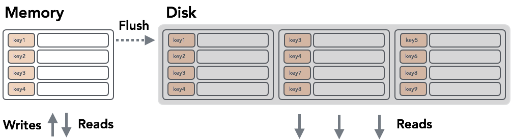

# lsm Tree

可变的数据结构 vs 不变的数据结构

- 不变数据结构的明显优点是可以最大程度地减少存储开销：我们不必为以后要插入的数据或更新记录需要比原始写入更多的空间保留任何额外的空间.
- 保持数据结构不变是有利于顺序写入的：数据是通过一次附加写入的方式单次写入磁盘的, 可变数据结构将在一次通过中预先分配， 但随后的写入是随机的.
- 不变文件的另一个优点是可以从磁盘读取数据，而操作之间没有任何段锁定，这大大简化了并发访问。
- 可变数据结构采用分层锁和闩锁，以确保磁盘上数据结构的完整性，同时允许多个读取器，但将部分树的专有所有权授予写入器。

## Sorted String Tables

Sorted String Tables的优势在于它们的简单性：它们易于编写，搜索和读取。 SSTables是从键到值的持久有序不可变映射，其中键和值都是任意字节字符串。它们具有一些不错的属性，例如，可以通过查找主索引，顺序扫描（即遍历指定键范围内的所有键/值对）来快速完成随机点查询（即按键查找值）只需依次读取记录即可有效地完成）。

SSTable 有两部份： index 跟data blocks, 如下图所示

由于SSTable是不可变的，因此插入，更新或删除操作需要重写整个文件，因为它针对读取进行了优化，是顺序写入的，并且没有保留任何可以进行就地修改的空白空间。

## LSM TREE

在LSM树中，所有写入都是针对可变的内存中数据结构执行的, 每当树的大小达到某个阈值时, 我们将数据写入磁盘，从而创建一个新的SSTable. 

检索数据可能需要搜索磁盘上的所有SSTable，检查内存表并将它们的内容合并在一起，然后再返回结果.

### 压缩

由于驻留在磁盘上的表的数量一直在增长，并且随着时间的推移，读取将变得越来越昂贵。为了避免这种情况，LSM树需要一个从磁盘读取完整SSTables并执行合并的过程，类似于我们在读取过程中必须执行的过程

### 合并

就合并而言，有两件重要的事情需要讨论：复杂性保证和影子逻辑。

就复杂性而言，合并SSTables与合并排序的集合相同。它有O(M)个内存开销，其中M是要合并的SSTable的数量。维护每个SSTable上迭代器头的排序集合log(n)。在每个步骤中，从排序的集合中获取最少的项，并从相应的迭代器中重新填充。

为了确保更新和删除工作，必须进行阴影处理：LSM树中的删除插入占位符，指定标记为删除的键。同样，更新只是具有更大时间戳的记录。在读取期间，被删除覆盖的记录不会返回到客户端。更新发生了相同的事情：从具有相同键的两个记录中，返回具有更高时间戳的记录。

#### 参考资料

[lsm tree](https://medium.com/databasss/on-disk-io-part-3-lsm-trees-8b2da218496f)