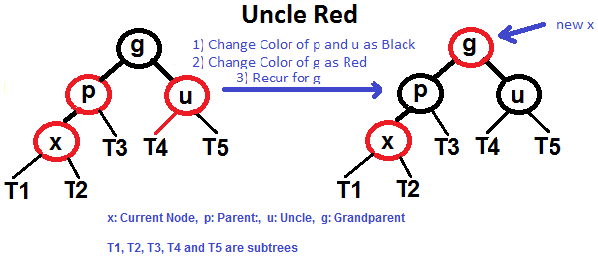
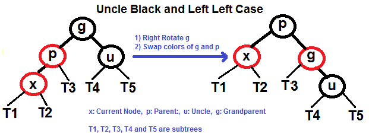
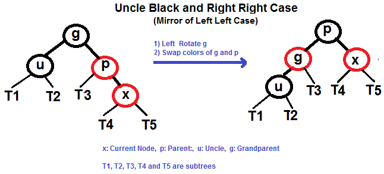
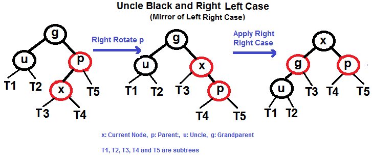

# 红黑树

红黑树是一个二分查找树具有下列的属性:

- 每一个节点要么是红的，要么是黑的
- 每一个叶子节点(null)是黑的
- 如果一个节点是红的， 那么它的两个孩子是黑色的
- 从节点到后代叶的简单路径包含相同数量的黑色节点。

一些结论：

一个红黑树具有n个内部节点，它的高度最大为 ```2log(n+1)```,  所以它搜索的复杂度为O(log n) 

## 红黑树的插入

1. 检查是否树为空
2. 如果树为空， 则新建一个黑色的root节点
3. 如果树不为空， 插入新的叶子节点， 颜色为红色
    - 如果新节点的父亲节点为黑色， 则退出操作
    - 如果新节点的父亲节点为红色， 检查父节点同级newNode的颜色
      - 如果颜色为黑色或NULL，则进行适当的旋转并重新着色。
      - 如果颜色为红色，则执行重新着色。重复相同的操作，直到树变为Red Black Tree。

### 重新着色

我们先尝试重新着色，如果重新着色不起作用，则进行旋转

1. 如果叔叔的颜色是红色的， 重新着色
2. 如果叔叔的颜色是黑色的， 则进行旋转或者重新着色

设x为要插入的节点

1. 插入x， 颜色为红色
2. 如果x是root节点， 则调整x的颜色为黑色
3. 重复下面的操作: 如果x的父亲不是黑色并且x不是root节点

    a. 如果x的叔叔是红色的 (x的爷爷必须为黑色)

        1. 调整x的叔叔和父亲为黑色的
        2. 调整x的的祖父为红色
        3. 将x的祖父递归， 重复2, 3
    

    b. 如果x的叔叔是黑色的, 会有下面四种情况， 设x的父亲为p， x的祖父为g

        1. left left case  （p是g的左子树， x是p的左子树)

    

        2. left right case  (p是g的左子树， x是p的右子树)

    

        3. right right case （1 的对称)

    

        4. right left case 

    


### 旋转的操作


左旋

```scala

private[this] def balanceLeft[A, B, B1 >: B](isBlack: Boolean, z: A, zv: B, 
    l: Tree[A, B1], 
    d: Tree[A, B1]): Tree[A, B1] = {
    if (isRedTree(l) && isRedTree(l.left))
      RedTree(l.key, l.value, BlackTree(l.left.key, l.left.value, l.left.left, l.left.right), 
      BlackTree(z, zv, l.right, d))
    else if (isRedTree(l) && isRedTree(l.right))
      RedTree(l.right.key, l.right.value, BlackTree(l.key, l.value, l.left, l.right.left), 
      BlackTree(z, zv, l.right.right, d))
    else
      mkTree(isBlack, z, zv, l, d)
  }
```

右旋
```scala
private[this] def balanceRight[A, B, B1 >: B](isBlack: Boolean, x: A, xv: B, 
    a: Tree[A, B1], r: Tree[A, B1]): Tree[A, B1] = {
    if (isRedTree(r) && isRedTree(r.left))
      RedTree(r.left.key, r.left.value, BlackTree(x, xv, a, r.left.left), 
      BlackTree(r.key, r.value, r.left.right, r.right))
    else if (isRedTree(r) && isRedTree(r.right))
      RedTree(r.key, r.value, BlackTree(x, xv, a, r.left), 
      BlackTree(r.right.key, r.right.value, r.right.left, r.right.right))
    else
      mkTree(isBlack, x, xv, a, r)
  }
```


#### 参考资料
[RBTree](https://www.geeksforgeeks.org/red-black-tree-set-2-insert/)

[red-black-trees](http://www.btechsmartclass.com/data_structures/red-black-trees.html)

[red_black](https://www.cs.auckland.ac.nz/software/AlgAnim/red_black.html)

[scala的红黑树实现](https://github.com/scala/scala/blob/2.13.x/src/library/scala/collection/immutable/RedBlackTree.scala)
