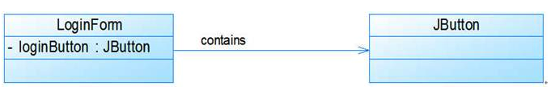
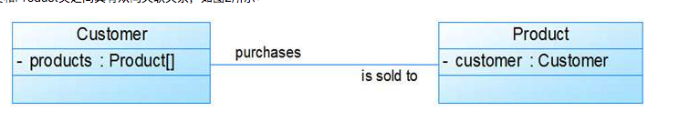
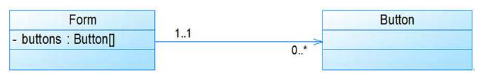
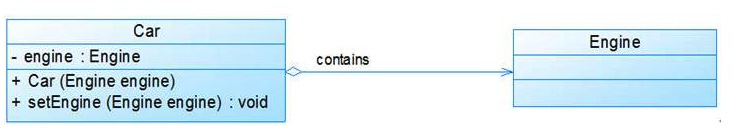
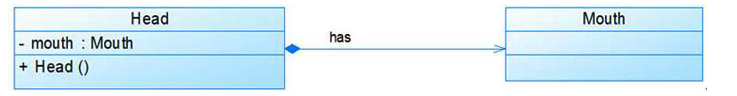
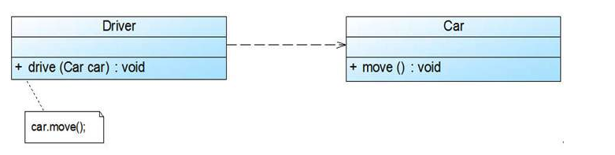
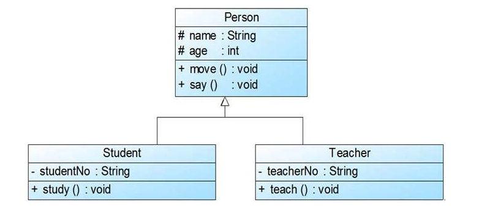
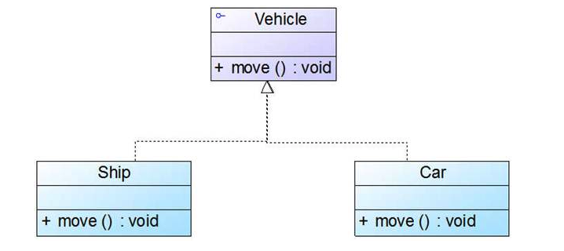

# 深入浅出UML类图

## 单向关联

用于表示一类对象与另一类对象之间有联系， 如下图所示， 登录框和按钮

用实线和尖头进行表示

## 双向关联

比如顾客购买商品并拥有商品， 卖出的商品总有某个顾客与之相关联

用实线表示双向关联

## 多重性关联

表示两个关联对象在数量上的对应关系。在uml中， 对象之间的多重性可以直接在关联直线
上用一个数字或一个数字范围表示。

对象之间可以存在多种多重性关联关系， 多重性表示如表1所示:

|表示方式|多重性说明|
|:--|:--|
|1..1|表示另一个类的一个对象只与该类的一个对象有关系|
|0..*|表示另一个类的一个对象与该类的零个或多个对象有关系|
|1..*|表示另一个类的一个对象与该类的一个或多个对象有关系|
|0..1|表示另一个类的一个对象没有或只有该类的一个对象有关系|
|m..n|表示另一个类的一个对象与该类最少m， 最多n个对象有关系(m <= n)|

比如一个界面可以拥有零个或多个按钮， 但是一个按钮只能属于一个界面， 一个Form类的对象可以与零个或多个Button类的对象相关联， 但一个Button类的对象只能与一个Form类的对象关联

## 聚合关系
聚合关系表示整体与部分的关系. 聚合关系中， 成员对象是整体对象的一部分， 但是成员对象可以脱离整体对象独立存在。

聚合关系使用带空心棱形的直线表示.

## 组合关系
组合(Composition)关系也表示类之间整体和部分的关系，但是在组合关系中整体对象可以控制成员对象的生命周期，一旦整体对象不存在，成员对象也将不存在，成员对象与整体对象之间具有同生共死的关系。

例如：人的头(Head)与嘴巴(Mouth)，嘴巴是头的组成部分之一，而且如果头没了，嘴巴也就没了，因此头和嘴巴是组合关系

组合关系用带实心菱形的直线表示

## 依赖关系

特定事物的改变可能会影响到使用该事物的其他事物， 在需要表示一个事物使用另一个事物时使用依赖关系。

比如司机依赖汽车

依赖关系使用带箭头的虚线表示.

## 泛化关系

泛化关系也就是继承关系， 用于描述父类与子类之间的关系.

泛化关系用带空心三角形的直线来表示.

## 接口与实现关系

类实现了接口

类与接口之间的实现关系用空心三角形的虚线来表示。

### 资料

[深入浅出UML类图](http://www.uml.org.cn/oobject/201211231.asp)

