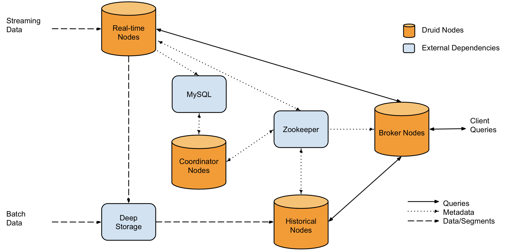

# 简介
Apache Druid是一款实时多维计算的时序数据库服务,  它的架构为存储与计算分离。

druid含有6个服务
- coordinator
- overload
- middle manager
- historical
- broker
- router

基于zookeeper做服务注册与服务发现， 在各服务启动时候向zookeeper注册其地址。

并通过数据库(mysql / postgresql / derby )保存其元数据信息 

  
**coordinator:** 协调服务， 获取segments的信息, 设置rules

**overload:** 统治节点， 相当于yarn的resoruce manager

**middle manager:** 中间节点， 当接受到用户的任务后， 启动一个劳工进行处理， 相当于yarn的node manager

**histroical:** 存储节点

**broker:** 查询节点

**router:** 路由节点