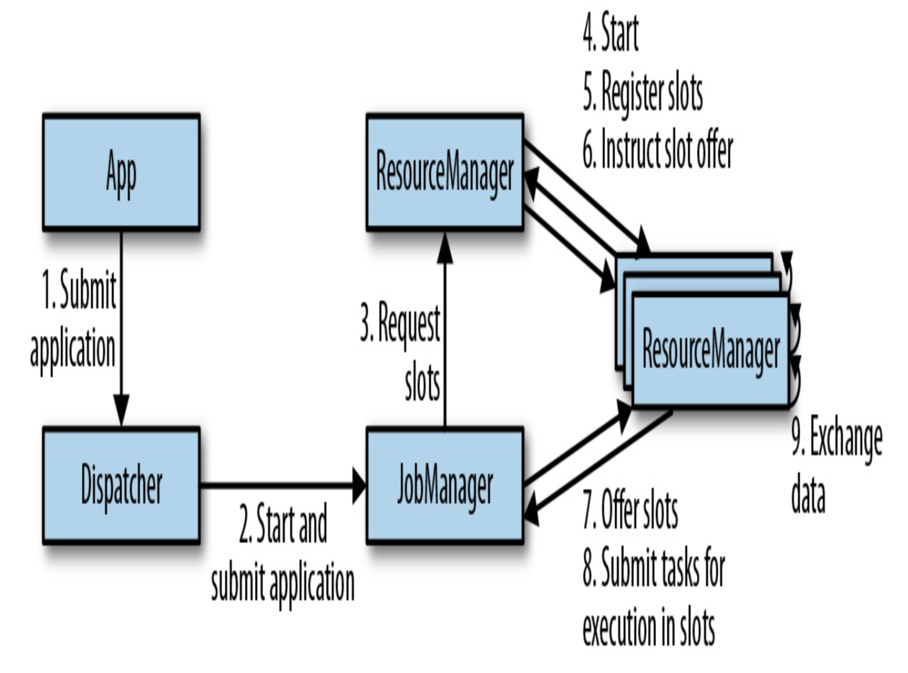

# 架构

flink有四个组件， 分别是
- JobManager
- ResourceManager
- TaskManager
- Dispatcher

## JobManager

jobManger主要控制单个appllcation， 不同的application被不同的jobManager控制。

jobManager需要必要的资源(TaskManager slots)来执行来自resourceManager的任务。当接收到足够的taskManager slots， 分发任务到TaskManager进行执行。

## ResourceManager

ResourceManager负责管理taskManager slots， flink的处理单元。 ResourceManager引导taskManger向jobManager提供空闲的slots。 如果ResourceManager没有足够的slots来满足jobManager的请求， 它会向资源提供服务(比如yarn)来启动容器来提供资源。 它同时会终止闲置的taskManagers来释放计算机资源。

## TaskManager
TaskManager是flink的工作进程. 每个taskManager提供slots， slots的个数限制了一个taskManager能够执行任务的个数。 

## Dispatcher
提供一个REST 接口用来提交执行的appilication.

### 高可用保证

#### TaskManager Failures
TaskManager 如果出现故障， jobManager会向ResourceManager请求相应的slots， 如果资源不够， jobManager不能重启application直到资源足够. 

#### JobManager Failures
JobManager存在单点故障， flink支持高可用模式， 通过zookeeper将对application的职责的元数据转移到另外的JobManager。

它通过以下的步骤进行恢复:

1. 向zookeeper请求JobGraph， Jar File， 状态(最后一个保存点).
2. 向resourceManager请求足够的slots
3. 重启application，重置它所有任务的状态通过保存点。

