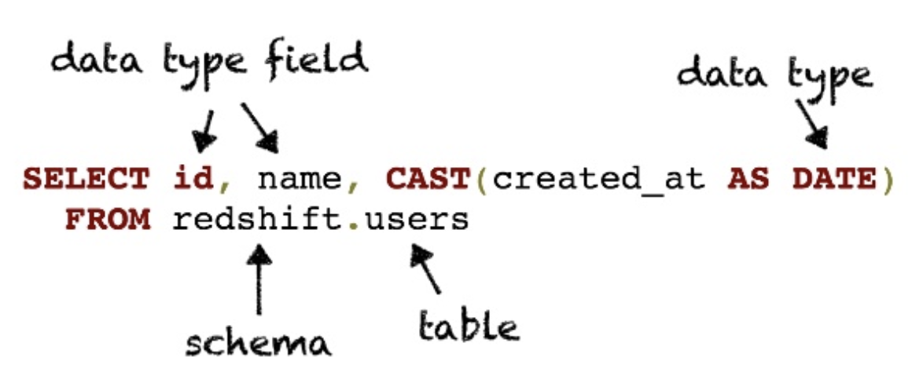
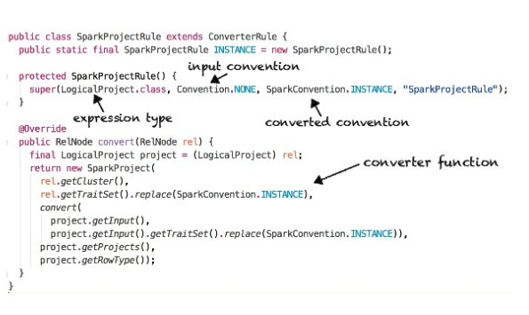
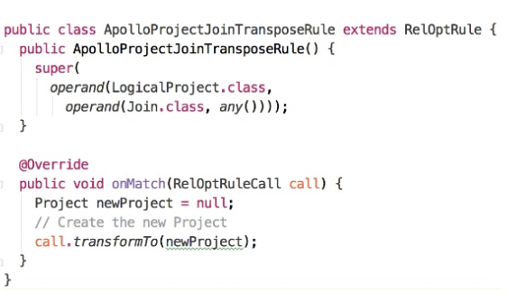

# Apache Calcite


Apache Calcite 是一个构造sql数据库的框架， 它主要有以下几个阶段:
- SQL parser
- SQL validation
- Query optimizer
- SQL generator
- Data federator

```
Query String <-> SqlNode <-> RelNode -- RexNode

paser -> validate -> optimize -> execute
```

## 组件

- catalog.  定义能通过sql querys能够获取到的metadata和namespaces 
- SQL Parser.  解析sql到一个抽象语法树(AST)
- SQL validator. 验证AST 通过metadata
- Query optimizer. 转化AST为逻辑计划， 优化逻辑计划， 转化成物理计划
- SQL generator - 转化物理计划为sql


### Catalog

**Schema:**
1. A collection of schemas and tables
2. Can be arbitrarily nested

```java
public interface Schema {

    Table getTable(String name);

    Set<String> getTableNames();

    Schema getSubSchema(String name);

    Set<String> getSubSchemaNames();
}
```

**Table:**
1. 一个数据集
2. 类型通过 RelDataType定义

```java
public interface Table {
    RelDataType getRowType(RelDataTypeFactory typeFactory);

    Statistic getStatistic();

    Schema.TableType getJdbcTableType();
}
```

**RelDataType:**
1. 代表数据集的类型


```java
public interface RelDataType {
    List<RelDataTypeField> getFieldList();
    boolean isNullable();

    RelDataType getCommponentType();
    RelDataType getKeyType();
    RelDataType getValueType();

    Charset getCharset();

    int getPrecision();
    int getScala();

    SqlTypeName getSqlTypeName(); // data type enum
}
```


**Statistic:**
提供优化中使用的表统计信息

```java
public interface Statistic {
    Double getRowCount();

    boolean isKey(ImmutableBitSet columns);

    List<Relcollation> getCollations();
    RelDistribution getDistribution();
}
```



### SQl parser
parser 是通过java cc 实现的

sqlDialect表示特定数据库的大小写和引用规则

### Query optimizer
关键概念
- Relational algebra   => RelNode
- Row expressions      => RexNode
- Traits               => RelTrait
- Conventions          => Convention
- Rules                => RelOptRule
- Planners             => RelOptPlanner
- Programs             => Program

#### Relational algebra
RelNode与spark DataFrame的方法有些类似, 代表一种关系表达式
```
TableScan       SparkTableScan
Project         SparkProject
Filter          SparkFilter
Aggregate       SparkAggregate
Join            SparkJoin
Union           SparkUnion
Intersect       SparkIntersect
Sort            SparkSort
```

#### Row expressions 
RexNode 与spark的列方法类似， 
```
Input column ref        RexInputRef
Literal                 RexLiteral
Struct field access     RexFieldAccess
Function call           RexCall
Window expression       RexOver

```


#### Traits
特质用来验证计划的输出
- Convention 
- RelCollation 
- RelDistribution

#### Rules
Rule用来修改查询计划

rules分为
- converters   
- transformers



**Pattern matching**




#### Planners

planners 有两个类型:
- HepPlanner      类似于spark optimizer， 应用所有的rules直到没有rule能够被应用, 有无限递归的风险
- VolcanoPlanner  是一种cost-based optimizer. 迭代rules， 选择cost最少的plan。


## 总结
```java
string sql = "select xxx " ;
        
// Parse the query
SqlParser parser = SqlParser.create(sql, parserConfig);
SqlNode sqlNode = parser.parseStmt();

...

// validate the query 
CalciteCatalogReader catalogReader = createCatalogReader();
SqlValidator validator = SqlValidatorUtil.newValidator(
            SqlStdOperatorTable.instance(), catalogReader, typeFactory, SqlConformance.DEFAULT);
SqlNode validatedSqlNode = validator.validate(sqlNode);

// Convert SqlNode to RelNode
RexBuilder RexBuilder = createRexBuilder();
RelOptCluster cluster = RelOptCluster.create(planner, RexBuilder);
sqlToRelConverter sqlToRelConverter = 
    new sqlToRelConverter(new ViewExpanderImpl(), validator, createCatalogReader(), cluster, convertletTable) ;

Relroot root = sqlToRelConverter.convertQuery(validatedSqlNode, false, true)


// optimize
Relroot root = sqlToRelConverter.convertQuery(validatedSqlNode, false, true);

RelOptPlanner planner = new VolcanoPlanner();

Program program = Programs.ofRules(
    FilterProjectTransposeRule.INSTANCE,
    ProjectMergeRule.INSTANCE,
    FilterMergeRUle.INSTANCE,
    LoptOptimizeJoinRule.INSTANCE
)


// Create a desired output trait set

RelTraitSet traitSet = planner.emptyTraitSet()
    .replace(SparkConvention.INSTANCE);

// Execute the program
RelNode optimized = program.run(planner, root.rel, traitSet);
```


    


