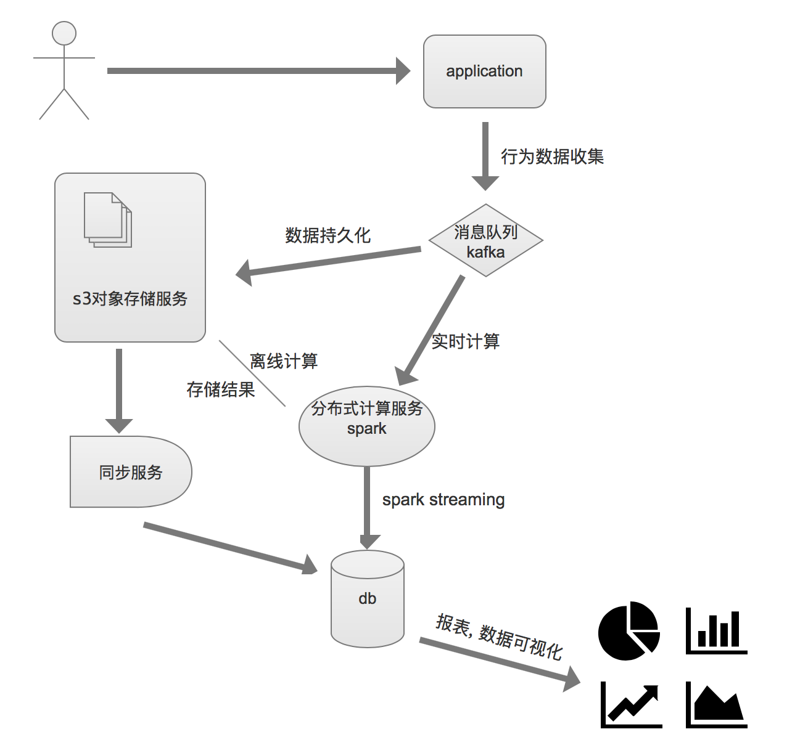
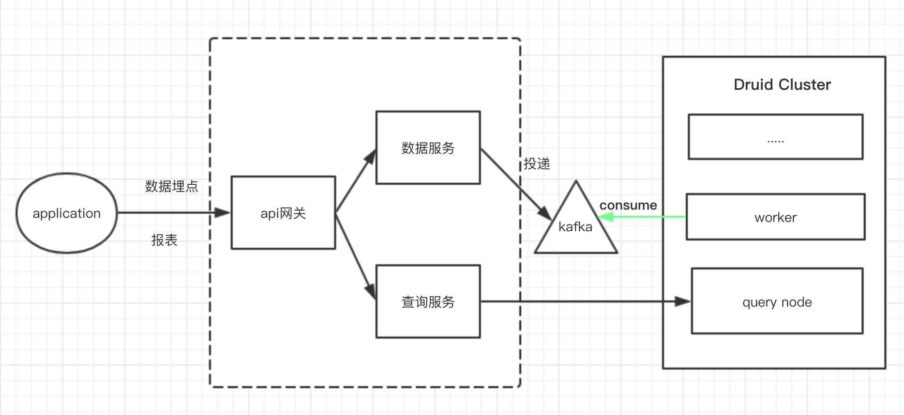

# kafka的使用场景

作为业务数据的pipeline. 各业务线将数据投递到kafka.

## 离线数据统计

1. 业务端发送埋点数据到kafka， 通过secor对消息做持久化， 以parquet格式上传到文件系统
2. 通过spark计算， 并将计算结果存在文件系统
3. 业务端按需同步数据， 写入db

***
优点： 计算结果准确

缺点： 离线数据统计时间太长

## 实时数据统计

1. 业务将数据上报到kafka
2. 在druid集群启动index-kafka任务消费数据
3. 提供业务端报表api

***
优点： 实时处理， 以api的方式反馈给业务端， 灵活度高

