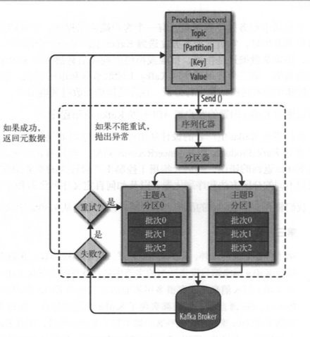

# kafka使用指南-生产者

下图展示了向kafka发送消息的主要步骤

## 参数
一个应用程序在很多情况下需要往kafka写入消息， kafka生产者api提供了很多参数供我们在不同的场景下面选择

|参数名|意义|
|---|----|
|bootstrap.servers|breoker的地址清单|
|key.serializer|序列化key|
|value.serializer|序列化value|
|acks|acks=0, 生产者在成功写入消息之前不会等待任何来自服务器的响应. acks=1, 集群的leader收到信息。acks=all, 集群所有brokers收到消息|
|buffer.memory|生产者内存缓冲区的大小|
|compression.type|压缩方式|
|retries|生产者可以重发消息的次数|
|batch.size|当有多个消息需要被发送到同一个分区时, 生产者会把它们放在同一个批次|
|linger.ms|指定了生产者在发送批次之前等待更多消息加入批次的时间|
|client.id|服务器用来识别消息的来源|

### 分区
默认的分区器:
1. 如果key为空， 记录将被随机地发送到主题内各个可用的分区上。分区器使用轮询(Round Robin)算法将消息均衡地分布到各个分区上。
2. 如果key不为空， 取key的哈希值， 根据哈希值将消息映射到特定的分区上。
