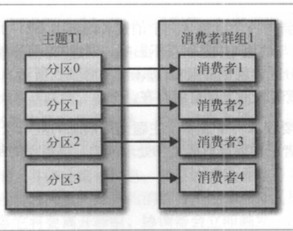

# kafka使用指南-消费者
Kafka消费者属于消费者群组。一个群组里的消费者订阅的是同-个主题，每个消费者接收主题一部分分区的消息。

如果消费组G1有4个消费者， 主题T1有4个分区， 整个过程如图所示

**如果我们往群组里添加更多的消费者，超过主题的分区数量，那么有一部分消费者就会被闲置，不会接收到任何消息**

## 消费者群组和分区再均衡
分区的所有权从一个消费者转移到另一个消费者， 这样的行为称为再均衡。在再均衡期间，消费者无陆读取消息，造成整个群组一小段时间的不可用。另外，当分区被重新分配给另一个消费者时，消费者当前的读取状态会丢失，它有可能还需要去刷新缓存 ，在它重新恢复状态之前会拖慢应用程序

消费者通过发送心跳到群组协调器的broker来维持它们和群组的从属关系， 只要消费者以正常的时间间隔发送心跳, 就被认为是活跃的。消费者会在轮询消息或者提交偏移量的时候发送心跳， 如果消费者停止发送心跳的时间足够长, 会话会过期， 协调器会触发一次再均衡.

### 参数
消费者api也提供多个api， 支持开发者在不同场景下做选择.

|参数|意义|
|---|----|
|fetch.min.bytes|从服务器获取记录最小的字节数|
|fetch.max.wait.ms|指定broker返回数据给消费者的时间|
|max.partition.fetch.bytes|从每个分区返回给消费者的最大字节数|
|session.timeout.ms|会话超时时间|
|auto.offset.reset|latest， 在偏移量无效的情况下， 消费者从最新的记录开始读取数据；earliest, 偏移量无效的情况， 消费者从起始位置读取分区的记录|
|enable.auto.commit|true 消费者自动提交偏移量, false， 自己控制何时提交偏移量|
|partition.assignment.strategy|分配策略|
|client.id|客户端标示|

#### 提交和偏移量
提交: 更新分区当前位置

消费者通过向_consumer_offset的特殊主题发送消息， 消息包含每个分区的偏移量.

当发生分区再均衡的时候， 
1. 如果提交的偏移量小于客户端处理的最后一个消息的偏移量, 那么处于两个偏移量之间的消息就会被重复处理.
2. 如果提交的偏移量大于客户端处理的最后一个消息的偏移量，那么处于两个偏移量之间的消息就会被丢失.

避免方式: 发生分区再均衡的时候使用手动提交. 

