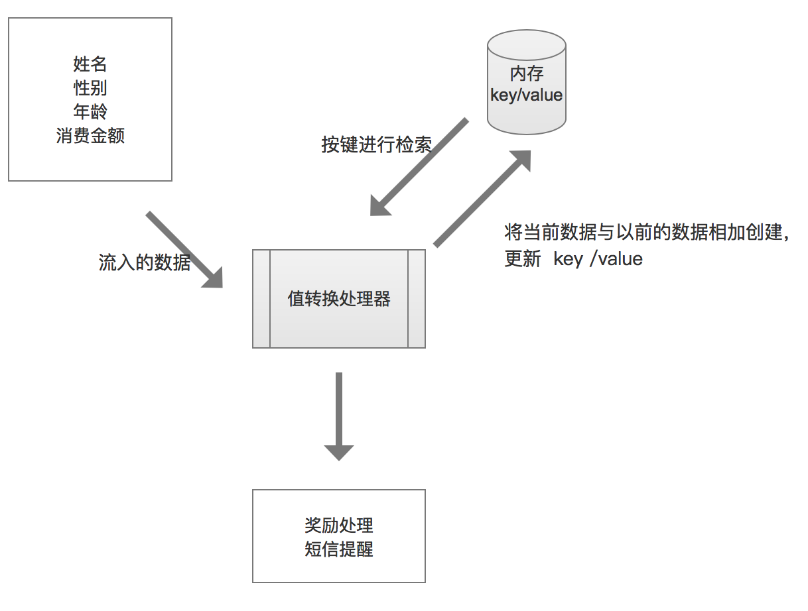

# 流和状态

有时候一个单独的事件并不能提供足够的信息来作决定, 比如需要对一个值进行累加， 这个时候就需要增加一些上下文， 产生静态资源的映像.


在流数据处理并不总是需要状态， 在某些情况下， 离散事件或记录可能已独自携带了足够有价值的信息。但通常情况下， 流入的数据需要从某类存储的数据来加以丰富.

## 将流状态操作应用到kafka stream

场景： 将客户消费进行累加。

stream数据:
```json
{
    "name": "wang",
    "sex": "male",
    "age": 11,
    "money": 999
}
```

### Serde

**通过json来做序列化和反序列化**

自定义数据类型：
```scala
case class Purchase(
  name: String,
  sex: String,
  age: Int,
  money: Int
)
```

#### 定义json数据类型
```scala
object Json {

  type ParseException = JsonParseException
  type UnrecognizedPropertyException = UPE

  private val mapper = new ObjectMapper()
  mapper.registerModule(DefaultScalaModule)
  mapper.setSerializationInclusion(JsonInclude.Include.NON_NULL)

  private def typeReference[T: Manifest] = new TypeReference[T] {
    override def getType = typeFromManifest(manifest[T])
  }

  private def typeFromManifest(m: Manifest[_]): Type = {
    if (m.typeArguments.isEmpty) {
      m.runtimeClass
    }
    else {
      new ParameterizedType {
        def getRawType = m.runtimeClass

        def getActualTypeArguments = m.typeArguments.map(typeFromManifest).toArray

        def getOwnerType = null
      }
    }
  }

  object ByteArray {
    def encode(value: Any): Array[Byte] = mapper.writeValueAsBytes(value)

    def decode[T: Manifest](value: Array[Byte]): T =
      mapper.readValue(value, typeReference[T])
  }

}
```

#### 序列化和反序列化
```scala
class JSONSerializer[T] extends Serializer[T] {
  override def configure(configs: util.Map[String, _], isKey: Boolean): Unit = ()

  override def serialize(topic: String, data: T): Array[Byte] =
    Json.ByteArray.encode(data)

  override def close(): Unit = ()
}

/**
  * JSON deserializer for JSON serde
  *
  * @tparam T
  */
class JSONDeserializer[T >: Null <: Any : Manifest] extends Deserializer[T] {
  override def configure(configs: util.Map[String, _], isKey: Boolean): Unit = ()

  override def close(): Unit = ()

  override def deserialize(topic: String, data: Array[Byte]): T = {
    if (data == null) {
      return null
    } else {
      Json.ByteArray.decode[T](data)
    }
  }
}
```

#### JSONSerde
```
class JSONSerde[T >: Null <: Any : Manifest] extends Serde[T] {
  override def deserializer(): Deserializer[T] = new JSONDeserializer[T]

  override def configure(configs: util.Map[String, _], isKey: Boolean): Unit = ()

  override def close(): Unit = ()

  override def serializer(): Serializer[T] = new JSONSerializer[T]
}

```

官方推荐的序列化用的是avro， 有兴趣的话可以参考[这篇文章](https://aseigneurin.github.io/2018/08/06/kafka-tutorial-7-kafka-streams-serdes-and-avro.html)


### 开发过程中调试

可通过Kstraem.print打印信息, 比如下面将原始流打印：

```scala
object Main extends App {

  import Serdes._

  val props: Properties = {
    val p = new Properties()
    p.put(StreamsConfig.APPLICATION_ID_CONFIG, "purchase")
    p.put(StreamsConfig.BOOTSTRAP_SERVERS_CONFIG, "xxxxx:9092")
    p
  }

  val builder: StreamsBuilder = new StreamsBuilder

  implicit val purchaseSuede = new JSONSerde[Purchase]

  val pstream = builder.stream[String, Purchase]("xxxx")


  pstream.print(Printed.toSysOut[String, Purchase])

  val streams: KafkaStreams = new KafkaStreams(builder.build(), props)
  streams.start()

  sys.ShutdownHookThread {
    streams.close(10, TimeUnit.SECONDS)
  }

}
```

***

### 处理步骤

使用值转换器(transformValues)处理器将无状态的奖励处理器转换为有状态的处理器.



transformValues 接受一个ValueTransformerSupplier[V, R]对象的参数。

以下为实现的几个类


V =>  Purchase 

R =>  RewardAccumulator

PurchaseRewardTransformer =>  实现ValueTransformer

```scala
class PurchaseRewardTransformer(val storeName: String)
  extends ValueTransformer[Purchase, RewardAccumulator]
{

  private var stateStore: KeyValueStore[String, Int] = _

  private var context: ProcessorContext = _


  override def init(context: ProcessorContext): Unit = {

    this.context = context
    stateStore = this.context.getStateStore(storeName).asInstanceOf[KeyValueStore[String, Int]]
  }

  override def transform(p: Purchase): RewardAccumulator = {

    var r = RewardAccumulator.build(p)

    val value = stateStore.get(r.name)

    if (value != null) {
      r.purchaseTotal += value
    }

    stateStore.put(r.name, r.purchaseTotal)
    r
  }

  override def close(): Unit = {}
}
```

#### 新建一个store

- 用高阶api
```
(Materialized.as("counts-store"))
```

- 用低阶api, 使用Store类几个静态工厂方法来创建存储供应者
    - Stores.inMemoryKeyValueStore
    - Stores.persistentKeyValueStore;
    - Stores.lruMap
    - Stores.persistentWindowStore
    - Stores.persistentSessionStore


1. 新建stateStore实例
    ```scala
        var storeSupplier = Stores.inMemoryKeyValueStore("store1")
    ```

2. 创建StoreBuilder并指定键和值的类型
    ```scala
        var storeBuilder = Stores.keyValueStoreBuilder(storeSupplier, Serdes.String, Serdes.Integer)
    ```
3. 将状态存储添加到拓扑
    ```scala
        builder.addStateStore(storeBuilder)
    ```

#### 完整代码

从topic为data1读取， 存储状态到store1， 输出到data2 topic


```scala
object Main extends App {

  import Serdes._

  val props: Properties = {
    val p = new Properties()
    p.put(StreamsConfig.APPLICATION_ID_CONFIG, "purchase")
    p.put(StreamsConfig.BOOTSTRAP_SERVERS_CONFIG, "xxxxx:9092")
    p
  }

  val builder: StreamsBuilder = new StreamsBuilder

  implicit val purchaseSuede          = new JSONSerde[Purchase]
  implicit val rewardAccumulatorSuede = new JSONSerde[RewardAccumulator]

  val pstream = builder.stream[String, Purchase]("data1")

  var storeSupplier = Stores.inMemoryKeyValueStore("store1")

  var storeBuilder = Stores.keyValueStoreBuilder(storeSupplier, Serdes.String, Serdes.Integer)

  builder.addStateStore(storeBuilder)


  val accuStream = pstream.transformValues(() => new PurchaseRewardTransformer("store1"), "store1")
    .asInstanceOf[KStream[String, RewardAccumulator]]
    .to("data2")

  val streams: KafkaStreams = new KafkaStreams(builder.build(), props)
  streams.start()

  sys.ShutdownHookThread {
    streams.close(10, TimeUnit.SECONDS)
  }

}
```

### 容错
所有的StateStoreSupplier类型默认都启用了日志(新建了一个topic)， 比如上面会创建一个topic[purchase-store1-changelog], 一旦运行kafka stream应用程序的机器宕机了， 重新启动即可， 这台机器的状态存储会恢复到它们原来的内容


可以通过设置 **retention.ms** 和 **retention.bytes**进行设置日志保留时间


