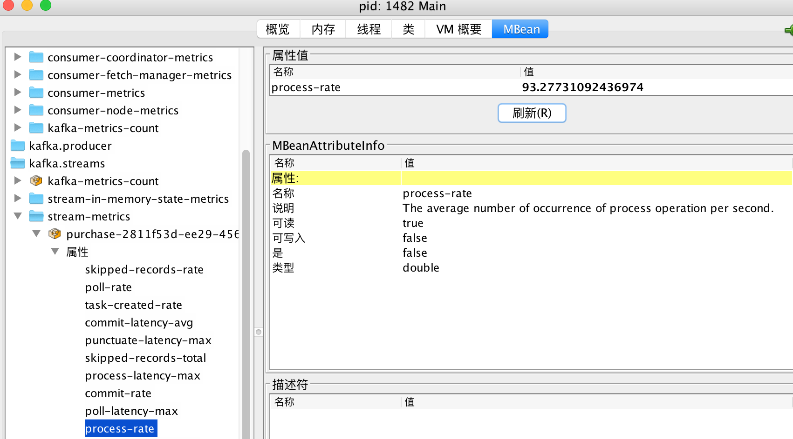

# 性能测量

性能测量对流式应用程序是至关重要的

- 线程指标
    - 提交，轮询和处理操作的平均时间；
    - 每秒创建的任务数， 以及每秒关闭的任务数.
- 任务指标
    - 每秒提交任务的平均数
    - 平均提交时间
- 处理器节点指标
    - 平均以及最大处理时间
    - 每秒处理操作的平均数
    - 转发速率
- 状态存储指标
    - put, get 和flush操作的平均执行时间
    - 平均每秒执行put， get和flush操作数

可以通过设置```StreamingConfig.METRICS_RECORING_LEVEL_CONFIG, "DEBUG")``` 来设置指标汇报


## 查看指标
通过Jconsole查看指标




如上图所示， 可以知道每秒处理的速率是93