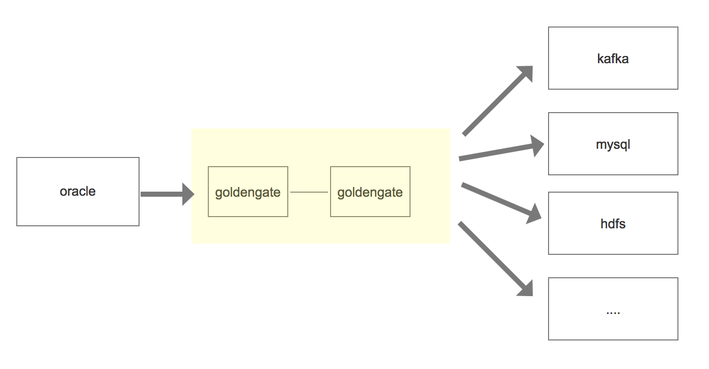

# Oracle Goldengate

在oracle中，goldengate的单向配置仅允许一个方向的数据工作流，仅从源到目标。源系统goldengate提取组从重做日志文件或archivelog中捕获更改信息，并将Oracle goldenGate跟踪转发到远程系统


具体的过程如下:




它包含以下进程：

1. **manager**: 在复制所涉及的所有服务器上运行。它是控制所有GG活动的主过程
2. **extract**: 在源数据库服务器上运行。如果是集成捕获，它将直接或间接从Oracle数据库中提取数据
3. **DATAPUMP**: 在源数据库服务器上运行。这是一个可选过程，它将提取的数据从源数据库服务器传输到目标数据库服务器。 （可选，因为EXTRACT流程可以直接执行此操作）。
4. **SERVER COLLECTOR**: 在目标数据库服务器上运行。从源数据库服务器接收提取的数据，并将其暂存到目标数据库服务器上的本地跟踪文件中，以便REPLICAT进程将其应用于目标数据库。
5. **REPLICAT**: 在目标数据库服务器上运行。从目标数据库服务器上的本地跟踪文件中读取提取的数据，并将数据应用于目标数据库。


# 安装

### 源数据库操作

#### 前提条件

需要oracle打开归档模式和重做日志文件

##### 归档模式

oracle具有两种操作模式: archivelog 和noarchivelog。 当数据库处于noarchivelog模式时候， 重做日志文件的循环重用意味着重做条目(前面事务的内容)在出现磁盘驱动器故障或与其他介质相关的故障时不再可用。

Archivelog模式将填满的重做日志文件发送到一个或多个指定的目的地。 并且可以在发生数据库介质故障事件后的任意给定时间点重新构造数据库。


##### 重做日志文件

oracle将添加，删除或改变数据， 一个条目写入当前的重做日志文件(redo log file)。它具有三个状态:

1. 当一个重做日志文件充满了重做日志条目时， 如果实例恢复仍需要它， 则当前的日志文件被标记为active
2. 如果实例不需要它， 则标记为inactive
3. 系统从文件开始处重新使用序列中的下一个日志文件， 并将其标记为current.


##### 操作流程

 1. ```
    su - oracle
    sqlplus / as sysdba
    ```

 2. 执行下面命令查看oracle是否为归档模式

    ```
    archive log list
    ```

    ```shell
    SQL> archive log list
    Database log mode	       No Archive Mode
    Automatic archival	       Disabled
    Archive destination	       USE_DB_RECOVERY_FILE_DEST
    Oldest online log sequence     907
    Current log sequence	       909
    ```

    若为disabled， 手动打开即可

    ```sh
    conn / as sysdba (以DBA身份连接数据库) 
    shutdown immediate (立即关闭数据库)
    startup mount (启动实例并加载数据库，但不打开)
    alter database archivelog; (更改数据库为归档模式)
    alter database open; (打开数据库)
    alter system archive log start; (启用自动归档)
    ```

3. oracle 打开日志开关

   通过下面的命令查看日志是否开启

   ```
   select force_logging, supplemental_log_data_min from v$database;
   ```

   ```
   SQL> select force_logging, supplemental_log_data_min from v$database;
   
   FOR SUPPLEME
   --- --------
   NO  NO
   ```

   若为NO，则需要通过命令修改

   ```
   alter database force logging;
   alter database add supplemental log data;
   ```

4. [ **可选**]     清理归档文件

   - 查看日志归档路径

   ```
   SQL > show parameter recover;
   ```

   - 启动 rman, 删除七天之前的归档文件

     ```
     RMAN> connect target /
     RMAN> DELETE ARCHIVELOG ALL COMPLETED BEFORE 'SYSDATE-7'; 
     ```

***

#### 安装ggsci

1. 下载**Oracle GoldenGate 11.2.1.0.0**, [下载地址](https://edelivery.oracle.com/osdc/faces/SoftwareDelivery)

2. 创建ogg目录

   ```shell
   mkdir -p /opt/ogg
   unzip V34339-01.zip
   tar xf fbo_ggs_Linux_x64_ora11g_64bit.tar -C /opt/ogg
   chown -R oracle:oinstall /opt/ogg （使oracle用户有ogg的权限，后面有些需要在oracle用户下执行才能成功）
   ```

3. 配置ogg环境变量

   ```shell
   export OGG_HOME=/opt/ogg
   export LD_LIBRARY_PATH=$ORACLE_HOME/lib:/usr/lib      
   export PATH=$OGG_HOME:$PATH
   ```

4. 测试一下ogg命令 ```ggsci```


#### 初始化ggsci

1. 创建初始化目录 

```GGSCI (hs-db-ora) 0> create subdirs```

2. 配置ogg全局变量

```
GGSCI (hs-db-ora) 8> dblogin userid model password model
Successfully logged into database.

GGSCI (hs-db-ora) 9> edit param ./globals
  
```

像vim一样编辑配置 (配置一个具有dba权限的schema)

```
oggschema model
```


#### 配置管理器mgr

```
GGSCI (hs-db-ora) 10> edit param mgr

-----------------

PORT 7809
DYNAMICPORTLIST 7810-7909
AUTORESTART EXTRACT *,RETRIES 5,WAITMINUTES 3
PURGEOLDEXTRACTS ./dirdat/*,usecheckpoints, minkeepdays 3

```

说明port即mgr的默认监听端口， DYNAMICPORTLIST动态端口列表，当指定的mgr端口不可用时，会在这个端口列表中选择一个，最大指定范围为256个；AUTORESTART重启参数设置表示重启所有EXTRACT进程，最多5次，每次间隔3分钟；PURGEOLDEXTRACTS即TRAIL文件的定期清理


#### 添加复制表

复制hdc_ods下的所有表

```
GGSCI (hs-db-ora) 17> add trandata hdc_ods.*
```


####  配置extract进程

```
GGSCI (hs-db-ora) 18> edit param extkafka

-----------------

extract extkafka
dynamicresolution
SETENV (ORACLE_SID = "orcl")
SETENV (NLS_LANG = "american_america.AL32UTF8")
userid model,password model
exttrail /opt/ogg/dirdat/to
table hdc_ods.*;
```

说明：第一行指定extract进程名称；dynamicresolution动态解析；SETENV设置环境变量，这里分别设置了Oracle数据库以及字符集；userid model,password  model即OGG连接Oracle数据库的帐号密码；exttrail定义trail文件的保存位置以及文件名，注意这里文件名只能是2个字母，其余部分OGG会补齐；table即复制表的表名，支持*通配，必须以;结尾


添加extract进程：

```
GGSCI (hs-db-ora) 22> add extract extkafka,tranlog,begin now
EXTRACT added.
```


添加trail文件的定义与extract进程绑定：

```
GGSCI (hs-db-ora) 23> add exttrail /opt/ogg/dirdat/to,extract extkafka
EXTTRAIL added.
```


#### 配置pump进程

pump进程本质上来说也是一个extract，只不过他的作用仅仅是把trail文件传递到目标端，配置过程和extract进程类似，只是逻辑上称之为pump进程

```
GGSCI (hs-db-ora) 26> edit param pukafka

-----------------

extract pukafka
passthru
dynamicresolution
userid model,password model
rmthost 172.16.3.76 mgrport 7809
rmttrail /opt/ogg/dirdat/to
table hdc_ods.*;
```

第一行指定extract进程名称；passthru即禁止OGG与Oracle交互，我们这里使用pump逻辑传输，故禁止即可；dynamicresolution动态解析；userid model,password model即OGG连接Oracle数据库的帐号密码,  rmthost和mgrhost即目标端OGG的mgr服务的地址以及监听端口；rmttrail即目标端trail文件存储位置以及名称。


分别将本地trail文件和目标端的trail文件绑定到extract进程：

```
1> add extract pukafka,exttrailsource /opt/ogg/dirdat/to
2> add rmttrail /opt/ogg/dirdat/to,extract pukafka

```


####  配置define文件

Oracle与MySQL，Hadoop集群（HDFS，Hive，kafka等）等之间数据传输可以定义为异构数据类型的传输，故需要定义表之间的关系映射，在OGG命令行执行：


```
GGSCI (hs-db-ora) 27> edit param test_ogg

-----------------

defsfile /opt/ogg/dirdef/hdc_ods.test_ogg
userid model,password model
table hdc_ods.*;
```


**在ogg主目录下执行:**

```
./defgen paramfile dirprm/test_ogg.prm
```

将生成的 dirdef/hds_ods.all 发送目标端ogg目录下的dirdef

```
scp -r /opt/ogg/dirdef/hdc_ods.test_ogg root@172.16.3.76:/opt/ogg/dirdef/
```

***


### 目标端操作

以kafka为例子

#### 前提条件

##### 安装kafka

1. 下载地址  [kafka](https://mirror.bit.edu.cn/apache/kafka/2.6.0/kafka_2.12-2.6.0.tgz)

2. 解压
3. 执行下面命令启动

```
bin/zookeeper-server-start.sh config/zookeeper.properties
bin/kafka-server-start.sh config/server.properties
```

##### 安装oracle goldengate for bigdata 

1. 下载**Oracle GoldenGate for Big Data**, [下载地址](https://edelivery.oracle.com/osdc/faces/SoftwareDelivery)

2.  创建ogg目录

   ```
   mkdir -p /opt/ogg
   unzip V983760-01.zip
   tar xf OGG_BigData_Linux_x64_19.1.0.0.1.tar -C /opt/ogg
   ```

3. 配置ogg环境变量

   ```shell
   export OGG_HOME=/opt/ogg
   
   # 指定一个jdk库
   export LD_LIBRARY_PATH=/usr/lib:/usr/lib/jvm/java-1.8.0-openjdk-1.8.0.262.b10-0.el7_8.x86_64/jre/lib/amd64/server
   
   export PATH=$OGG_HOME:$PATH
   ```

4. 测试一下ogg命令 ```ggsci```


#### 初始化ggsci

进入命令行， 

```
GGSCI (hs-db-ora) 0> create subdirs
```

#### 配置管理器mgr

```
GGSCI (ambari.slave1.com) 1>  edit param mgr

-----------------

PORT 7809
DYNAMICPORTLIST 7810-7909
AUTORESTART EXTRACT *,RETRIES 5,WAITMINUTES 3
PURGEOLDEXTRACTS ./dirdat/*,usecheckpoints, minkeepdays 3
```

#### 配置checkpoint

checkpoint即复制可追溯的一个偏移量记录，在全局配置里添加checkpoint表即可。

```
edit param ./GLOBALS

-----------------

CHECKPOINTTABLE ogg.checkpoint
```

#### 配置replicate进程

```
edit param rekafka

-----------------

REPLICAT rekafka
sourcedefs /opt/ogg/dirdef/hdc_ods.test_ogg
TARGETDB LIBFILE libggjava.so SET property=dirprm/kafka.props
REPORTCOUNT EVERY 1 MINUTES, RATE
GROUPTRANSOPS 10000
MAP hdc_ods.*, TARGET hdc_ods.*;
```

说明：REPLICATE rekafka定义rep进程名称；sourcedefs即在在源服务器上做的表映射文件；TARGETDB LIBFILE即定义kafka一些适配性的库文件以及配置文件，配置文件位于OGG主目录下的dirprm/kafka.props；REPORTCOUNT即复制任务的报告生成频率；GROUPTRANSOPS为以事务传输时，事务合并的单位，减少IO操作；MAP即源端与目标端的映射关系

#### 配置kafka.props

```sh
cd /opt/ogg/dirprm
vim kafka.props
```

**kafka.props**

```properties
gg.handlerlist=kafkahandler
gg.handler.kafkahandler.type=kafka
gg.handler.kafkahandler.KafkaProducerConfigFile=custom_kafka_producer.properties
gg.handler.kafkahandler.topicMappingTemplate=hdc_ods
gg.handler.kafkahandler.format=json
gg.handler.kafkahandler.mode=op
gg.classpath=dirprm/:/opt/kafka/kafka_2.12-2.6.0/libs/*:/opt/ogg/:/opt/ogg/lib/*
```

```sh
vim custom_kafka_producer.properties
```

```properties
bootstrap.servers=172.16.3.76:9092
acks=1
compression.type=gzip
reconnect.backoff.ms=1000
value.serializer=org.apache.kafka.common.serialization.ByteArraySerializer
key.serializer=org.apache.kafka.common.serialization.ByteArraySerializer
batch.size=102400
linger.ms=10000
```

#### 添加trail文件到replicate进程

````
GGSCI (localhost.localdomain) 11> add replicat rekafka exttrail /opt/ogg/dirdat/to,checkpointtable ogg.checkpoint
````


### 启动所有进程

启动顺序为


源mgr——目标mgr——源extract——源pump——目标replicate来完成


#### 源端

```sh
start mgr
start extkafka
start pukafka
```


#### 目标端

```
start mgr
start rekafka
```


分别在源端以及目标端使用 ```info all``` 查看进程是否全部启动成功	

**源端:**

```
GGSCI (hs-db-ora) 16> info all

Program     Status      Group       Lag at Chkpt  Time Since Chkpt

MANAGER     RUNNING
EXTRACT     RUNNING     EXTKAFKA    00:00:00      00:00:02
EXTRACT     RUNNING     PUKAFKA     00:00:00      00:00:03
```

**目标端:**

```
GGSCI (localhost.localdomain) 18> info all

Program     Status      Group       Lag at Chkpt  Time Since Chkpt

MANAGER     RUNNING
REPLICAT    RUNNING     REKAFKA     00:00:00      00:00:09
```

状态为running代表所有的启动成功了


###  运行

执行sql

```sql
INSERT INTO "HDC_ODS"."TEST_OGG" ("ID", "NAME") VALUES (1, 'fffff');
INSERT INTO "HDC_ODS"."TEST_OGG" ("ID", "NAME") VALUES (2, 'fffff');
commit;
```


消费kafka

```sh
./kafka-console-consumer.sh  --topic hdc_ods --bootstrap-server localhost:9092 --from-beginning

{"table":"HDC_ODS.TEST_OGG","op_type":"I","op_ts":"2020-10-12 15:29:36.997586","current_ts":"2020-10-12T15:29:43.087000","pos":"00000000000000001444","after":{"ID":1,"NAME":"fffff"}}
{"table":"HDC_ODS.TEST_OGG","op_type":"I","op_ts":"2020-10-12 15:29:36.997586","current_ts":"2020-10-12T15:29:43.089000","pos":"00000000000000001589","after":{"ID":2,"NAME":"fffff"}}
```

