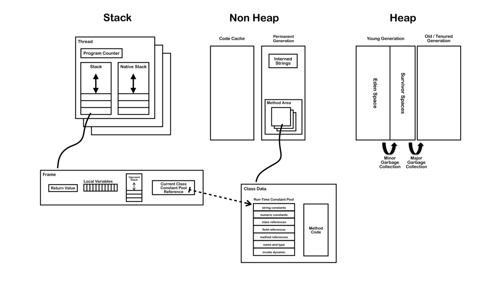

# jvm

jvm各个组件如图所示

## 各个组件解释

### Thread
线程是程序中的执行线程。 JVM允许应用程序具有多个并发运行的执行线程。在Hotspot JVM中，Java线程和本机操作系统线程之间存在直接映射。在为Java线程准备了所有状态（例如线程本地存储，分配缓冲区，同步对象，堆栈和程序计数器）之后，将创建本机线程。 Java线程终止后，将回收本机线程。因此，操作系统负责调度所有线程并将其分配给任何可用的CPU。一旦本机线程初始化，它将调用Java线程中的run（）方法。当run（）方法返回时，将处理未捕获的异常，然后本机线程确认是否需要由于线程终止（即，它是最后一个非守护线程）而终止JVM。当线程终止时，将释放本机线程和Java线程的所有资源。

#### Jvm System Threads

后台的系统线程有:

**VM thread:** 这个线程主要的操作为"stop-the-world"垃圾回收， 线程堆栈转储， 线程悬挂， 偏向的锁定吊销。

**Periodic task thread:** 这个线程负责定时事件， 执行周期性的调度任务

**GC threads:**  执行JVM的垃圾回收工作

**Compiler threads:** 将编译好的字节码转化为可执行的代码.

**Signal dispatcher thread:** 该线程接收发送到JVM进程的信号，并通过调用适当的JVM方法在JVM内部对其进行处理。

#### 单个线程

每个线程都包含以下组件 

- Program Counter(PC)

当前指令（或操作码）的地址，除非它是本地的。如果当前方法是本地方法，则PC是未定义的。所有CPU都有PC，通常PC在每条指令后都会递增，因此保留下一条要执行的指令的地址。 JVM使用PC跟踪其执行指令的位置，实际上PC会指向“方法区域”中的内存地址。

- Stack

堆栈为在该线程上执行的每个方法保存一个栈帧， 当前正在执行的方法位于堆栈的顶部， 对于每个方法的调用， 
都会创建一个新的栈帧并使其push到堆栈的顶部

- Stack Restrictions

堆栈可以是动态或固定大小。如果线程需要的堆栈多于允许的堆栈，则会引发StackOverflowError。如果一个线程需要一个新的帧，并且没有足够的内存来分配它，则抛出OutOfMemoryError。

- Frame

栈帧。 它包含了以下元素

- 本地变量数组
- 返回值
- 操作堆
- 对当前方法类的运行时常量池的引用

## Heap
堆用于在运行时分配类实例和数组。数组和对象永远不能存储在堆栈上，因为创建栈帧后，栈帧的大小不能更改。该栈帧仅存储指向堆上对象或数组的引用。与原始变量和局部变量数组（在每一帧中）中的引用不同，对象始终存储在堆中，因此在方法结束时不会将其删除。而是仅由垃圾收集器删除对象。

为了支持垃圾回收，堆分为三个部分：

- Young Generation （经常被分为eden 和 Survivor） 
- Old Generation
- Permanent Generation

### 内存管理
jvm从不显式地取消分配对象和数组，而是由垃圾收集器自动回收它们。

它的工作步骤如下:
1. 新对象和数组被创造到young Generation
2. 小垃圾收集将在young Generation中开展。仍然存在的对象将从eden转移到Survivor。
3. 大型垃圾回收通常会导致应用程序线程暂停，它将在各代之间移动对象。仍然存在的对象将从年轻一代转移到老一代
4. 每次收集old generation时，都会收集permanaent generation。它们中的一个变满时，它们都会被收集。

## Non-Heap Memory

在逻辑上被视为JVM机制一部分的对象不会在堆上创建。  Non-Heap Memory包含：
- the method area 方法区域
- interned strings 
- code cache (用于编译和存储已由JIT编译器编译为本机代码的方法)

### JIT 及时编译
为了提高性能，Oracle Hotspot VM查找定期执行的字节码“热”区域，并将其编译为本机代码。然后将本机代码存储在非堆内存中的代码缓存中。这样，Hotspot VM会尝试选择最合适的方式来权衡编译代码所花费的额外时间与执行解释代码所花费的额外时间。

## 参考资料
[JvmInternals](https://blog.jamesdbloom.com/JVMInternals.html)