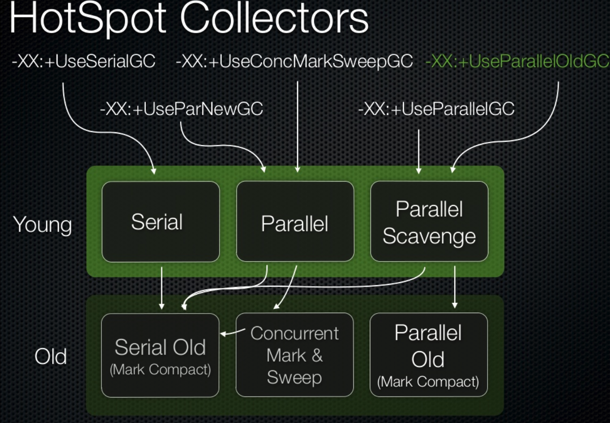

# 垃圾回收

垃圾回收的方式有
- 并发的回收， 应用程序并发执行的垃圾回收操作
- 并行的回收， 利用多核的cpu来执行垃圾回收
- Stop-the-world， 停止应用程序， 进行垃圾回收

young generation 通常使用 copying collector
young generation 通常是单块的， stop-the-world

old generation 使用 mark / sweep / compact

## 指标来判断垃圾回收

- Allocation rate  （分配字节的速率)
- Mutation rate    （更新内存引用的速率)
- Marking time      (收集器花费多久去寻找存活的对象)
- Compaction time   (压缩时间)

### 优化策略

- 扩大小垃圾回收的次数, 尽可能地避免大垃圾回收

- 指定 Xms = Xmx  停止重新分配区域大小， 避免full gc
- 指定 XX:PermSize = XX:MaxPermSize， 停止重新分配区域大小， 避免full gc
