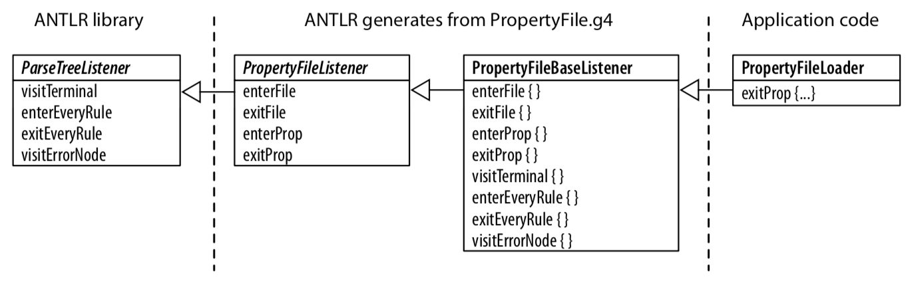
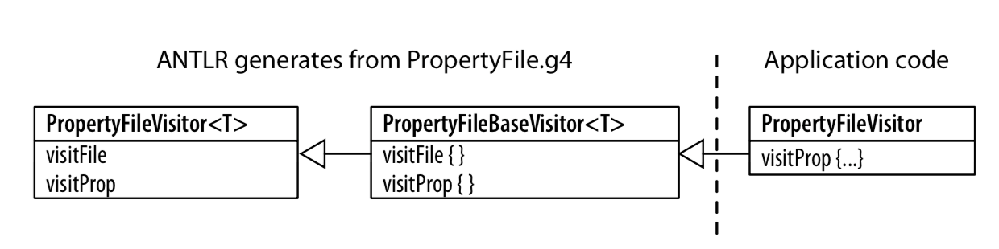

# antlr

antlr是一个语法解析的库， 它实现了定义简单的语法， 生成相应的解析语法文件， 支持多种编程语言(java, c++, python)


## 语法设计
antlr核心语法

|Syntax|Description|
|:--|:--|
|x|Match token, rule reference, or subrule x.|
|x y ...z|Match a sequence of rule elements|
|(...\|...\|...)|Subrule with multiple alternatives|
|x?|Match x or skip it|
|x*|Matxh x zero or more times.|
|X+|Matxh x one or more times.|
|r:...;|Define rule r.|
|r:...\|...\|....;|Define rule r with multiple alternatives|


### Sequence

'+'： 代表1个或多个元素

‘*'： 代表0个或多个元素


示例:
```
file: (row '\n')*;            //sequence with a '\n' terminator
row: field (',', field)*;     //sequence with a ','  seperator
field: int;                   //assume fields are just integers
```

```
stats: (stat ';')*;           //match zero or more ';' -terminated statements
```


### Choice

使用 '|' 处理选择

示例:

```
type : 'float' | 'int' | 'void'; // user-defined types
```

### Token Dependecy
使用括号进行声明

示例:

```
vector: '[' INT+ ']' ;  // [1], [1 2], [1 2 3], ....
```

### Nested Phrase
示例:

```
expr: ID '[' expr ']'    // a[1], a[b[1]]
    | '(' expr ')'       // (1) (a[1]) (((1)))
    | INT                // 1, 94117
    ;
```


### 运算符优先级
通过定义运算符的顺序(从上到下)来区分优先级， 默认求值顺序为左到右。

示例：
```
expr: expr '^'  expr
    | expr '*'  expr
    | expr '+'  expr
    | INT
    ;

(1 + 2 * 4 ^ 4)  =>  1 + (2 * (4 ^ 4))
```

### 词法分析器

匹配器

示例:

```
ID: ('a'..'Z'|'A'..'Z')+;  // match 1-or-more upper or lowercase letters.
ID: [a-zA-Z]+ ;            // match 1-or-more upper or lowercase letters
```

匹配数字：
```
INT: '0' .. '9'+;
FLOAT: DIGIT + '.' DIGIT*
     |         '.' DIGIT
     ;

DIGIT : [0-9];
```

匹配字符串:

```
STRING: '"' .*? '"';
```

匹配空白符和评论
```
assign : ID (WS|COMMENT)? '=' (WS|COMMENT)? expr (WS|COMMENT)? ;


LINE_COMMENT : '//' .*? '\r'? '\n' -> skip; // Match "//" stuff '\n'
COMMENT : '/*' .*? /*/             -> skip; // Match "/*" stuff "*/"

WS: (' '|'\t'|'\r'|'\n')+ -> skip;
```

## 语法和应用代码分离

当我们通过antlr定义语法后， 接下来就需要将语法和应用代码结合起来

antlr提供以下方式:
- 继承parser 
- 基于parse-tree listeners
- 实现application基于visitors

首先看了一个简单的实现:


```g4
grammer PropertyFile;
@members {
    void startFile() { }
    void finishFile() { }
    void defineProperty(Token name, Token value) { }
}
file : {startFile();} prop+ {finishFile();} ;
prop : ID '=' STRING '\n' {defineProperty($ID, $STRING)} ;
ID : [a-z]+ ;
STRING: '"' .*? '"';
```

通过antlr生成**PropertyFileParser**, 实现一个类， 继承**PropertyFileParser**

```Java
class PropertyFilePrinter extends PropertyFileParser {
    void defineProperty(Token name, Token value) {
        System.out.println(name.getText()+"="+value.getText());
    }
}
```

运行这个application

```java
PropertyFileLexer lexer = new PropertyFileLexer(input);
CommonTokenStream tokens = new CommonTokenStream(lexer);
PropertyFilePrinter parser = new PropertyFilePrinter(tokens);
parser.file();
```

### 基于parse-tree listeners的实现
```g4
#PropertyFile.g4
file: prop+ ;
prop: ID '=' STRING '\n';
```

```properties
#t.properties

user="parrt"
machine="maniac"
```

**通过PropertyFile.g4， antlr将会生成一个接口*PropertyFileListener*, 对于每个rule都会生成进入，和离开事件.**

```java
import org.antlr.v4.runtime.tree.*;
import org.antlr.v4.runtime.Token;

public interface PropertyFileListener extends ParseTreeListener {
    void enterFile(PropertyFileParser.FileContext ctx);
    void exitFile(PropertyFileParser.FileContext ctx);
    void enterProp(PropertyFileParser.PropContext ctx);
    void exitProp(PropertyFileParser.PropContext ctx);

}

```


默认实现允许我们仅覆盖和实现我们关心的那些方法， 这里是重新实现PropertyFileLoader， 具有监听器机制:
```Java
public static class PropertyFileLoader extends PropertyFileBaseListener {
    Map<String, String> pops = new OrderedHashMap<String, String>();
    public void exitProp(PropertyFileParser.PropContext ctx) {
        String id = ctx.Id().getText()
        String value = ctx.STRING().getText();
        props.put(id, value);
    }
}
```
这个版本的实现与上个版本的差异是继承于base listener 而不是parser, 流程图如下

运行这个application
```Java
ParseTreeWalker walker = new ParseTreeWalker();
PropertyFileLOader loader = new PropertyFileLoader();
walker.walk(loader, tree);
System.out.println(loader.props);

```

### 实现应用通过visitors

当我们使用 -visitor 命令， antlr会生成*PropertyFileVisitor*接口和类*PropertyFileBaseVisitor*

```java
public class PropertyFileBaseVisitor<T> extends AbstractParseTreeVisitor<T> implements PropertyFileVisitor<T>
{
    @Override public T visitFile(PropertyFileParser.FileContext ctx) { ... } 
    @Override public T visitProp(PropertyFileParser.PropContext ctx) { ... }
}
```

我们可以复制上面在exitPop里面实现的方法到visitProp里面
```java
public static class PropertyFileVisitor extends PropertyFileBaseVisitor<Void>
{
    Map<String,String> props = new OrderedHashMap<String, String>(); 
    public Void visitProp(PropertyFileParser.PropContext ctx) {
        String id = ctx.ID().getText(); // prop : ID '=' STRING '\n' ; 
        String value = ctx.STRING().getText();
        props.put(id, value);
        return null; // Java says must return something even when Void
    } 
}
```

流程为

运行这个application
```java
PropertyFileVisitor loader = new PropertyFileVisitor(); 
loader.visit(tree);
System.out.println(loader.props); // print results

```

## 小试牛刀
使用命令行处理excel / csv文件(基于sql).

语法层: 使用antlr

执行层: 使用pandas api

项目地址: 


