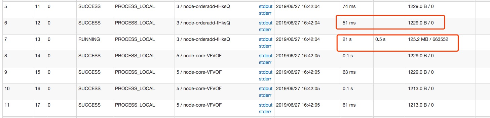
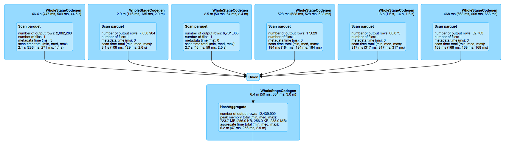

# 优化


## 增量计算

场景： 统计用户的评论数， 1天内会运行多次

数据最简为:

|time|user_id|comment|
|:--|:--|:--|
|xxx|xxx|xxxx|

每天新增的数据量地址为：  event/comment/2019/01/01/comment/*.parquet

### 全量方式

```sql
select
    user_id
    count(1) as comment_times
from user_comment
group by user_id

```

### 增量方式

1. 将结果写到结果集， 同时写一份到另外的地方作为缓存集 cache/2019/01/01/comment/*.parquet
2. 第二天增量数据为:  event/comment/2019/01/02/comment/*.parquet 

将最新的数据计算， union缓存数据, 再计算
```sql
select t.user_id, sum(t.comment_times) as comment_times
from (select user_id, count(1) as comment_times from user_comment group by user_id
      union
      select * from cache) t
group by t.user_id
```

**注意:**

```scala
df.write
    .mode("overwrite")
    .parquet(s"s3a://${bucket}/analyse/results/activity/user_comment")

df.write
    .mode("overwrite")
    .parquet(s"s3a://${bucket}/analyse/cache/activity/user_comment/${RunDate}")
```
以这种方式写两份的话， 会导致计算两次。

可通过外部程序将results/.../user_comment 复制到 cache/..../user_comment里面

***


## 数据倾斜

**定位数据倾斜:**

如图所示， 在一个stage阶段发现任务的处理数据量一个是1kb 一个是125Mb， 上面那个任务已经运行完了，在等待下面, 


### 处理的步骤
知道数据倾斜发生在哪一个stage之后，接着我们就需要根据stage划分原理，推算出来发生倾斜的那个stage对应代码中的哪一部分

**本次示例的sql是: 统计每个视频每分钟观看消耗的流量**
```sql
select
  from_unixtime(unix_timestamp(time, "dd/MMM/yyyy:HH:mm:ss Z"), "YYYY-MM-dd HH:mm:00") as time,
  videoId,
  cast(sum(size) as long) as size
from vod
group by videoId, time
order by time
```

看物理执行图可知



大量不同的key被分配到了相同的task, 造成该Task数据量比较大.

```
output rows 最高:最低 =>   7,850,904: 17,623
```

造成原因:

本次读取的就是6个文件， 3个大文件(155M左右)， 3个小文件(300kb左右)

解决方案： 

整理文件， 将文件分片均匀


####  关于join的数据倾斜
在SQL连接操作中，更改连接键以均匀方式重新分配数据，以便分区处理不会花费更多时间。

这种技术称为 "加盐"， 具体的可以参看这篇文章[Why Your Spark Apps Are Slow Or Failing](https://dzone.com/articles/why-your-spark-apps-are-slow-or-failing-part-ii-da)

#### shuffle
关于shuffle过程详细解释可以看这篇文章[spark-internals](https://spark-internals.books.yourtion.com/markdown/4-shuffleDetails.html)


#### 其他
推荐大佬写的 [解决Spark数据倾斜（Data Skew）的N种姿势](http://www.jasongj.com/spark/skew/)


***

## 关于硬件
做到极致运用前需要了解下面几个参数:

每个spark executor拥有固定的核数和堆大小， 如果是spark on yarn 的话这个需要调整yarn的参数

- ```yarn.nodemanager.resource.cpu-vcores``` 控制在每个节点上 ```container``` 能够使用的最大core个数
- ```yarn.nodemanager.resource.memory-mb``` 控制在每个节点上 ```container``` 能够使用的最大内存；


- ```--executor-cores```  设置spark 每个executor的并发数 ```--executor-cores 5 ``` 代表1个executor可以同时运行5个任务
- ```--executor-memory``` 设置spark executor堆的大小


Full gc会导致计算时间延长， 在spark ui上面会有 Task time （gc time)这一列， 当它变红了就说明gc时间过长, 超过了任务时长的10%

关于gc的调优， 可参考这篇文章[高级GC调优](https://github.com/endymecy/spark-config-and-tuning/blob/master/spark-tuning.md)

