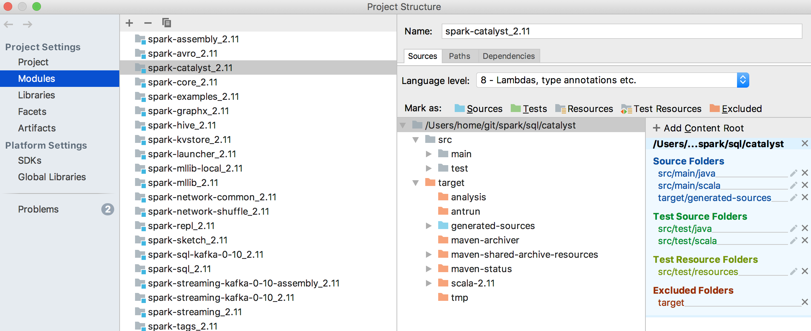
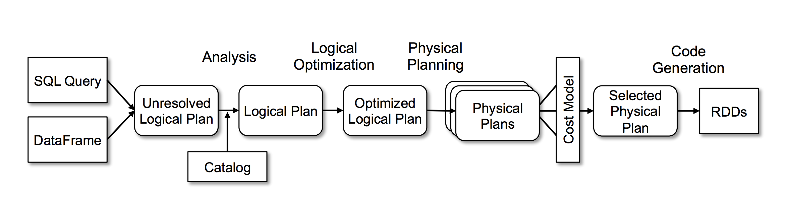
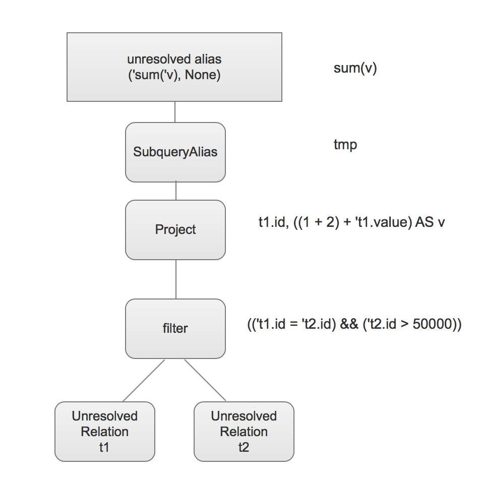
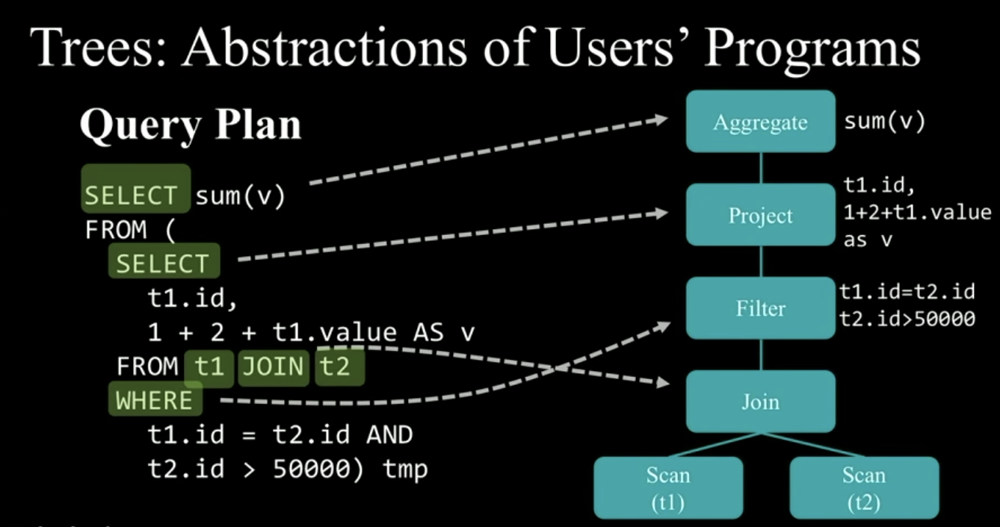
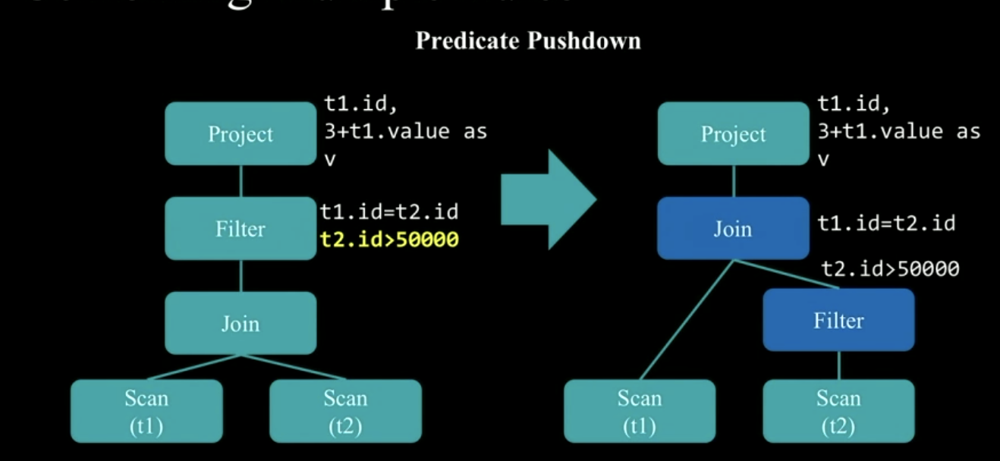
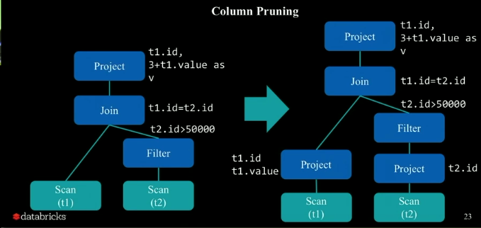

# spark-sql


## Debug in Idea
1. 下载spark源码
```shell
git clone https://github.com/apache/spark.git
```

2. Build

```shell
./build/mvn -DskipTests clean package
```

3. AstBuilder.scala里面会依赖通过antlr生成的文件， 编译之后需要在spark-catalyst添加源文件, 

    **具体操作步骤:**
    ```
    File ->  
        Project Structure -> 
            选中spark-catalyst_2.11 -> 
                添加target/generated-sources为源文件夹
    ```



4. 在idea配置remote debugging, 
    **操作步骤:**
        ```
        Run -> 
            Edit Configurations
                -> +
                    -> Remote 
                        -> 默认的配置就行, 保存
        ```

5. 使用spark-shell进行触发， 
    ```
        SPARK_SUBMIT_OPTS="-agentlib:jdwp=transport=dt_socket,server=y,suspend=n,address=5005" ./bin/spark-shell
    ```

6. 在idea对代码打断点，启动监听,  回到第5步输入相应的代码进行触发。 
    
    

### 执行流程



当执行一个sql的时候， 它会经历以下过程：

- Parser使用antlr解析sql，  生成Unresolved Logical Plan
- 通过Catalog获取表信息， 根据Analyser定义好的rule做模式匹配，  生成Resolved Logical Plan
- Optimizer 会对Resolved Logical Plan 进行优化, 生成 Optimized Logical Plan
- Query Planner 将Optimized Logical Plan转换成多个 Physical Plan
- cost model 选取代价最小的物理计划
- code generation 转换成java的字节码， 加快运行

#### Parser
代码 org.apache.spark.sql.parser

使用antlr对sql进行词法分析, 并转化成trees

执行sql场景:
```sql
select
    sum(v)
from
    (select 
        t1.id,
        1 + 2 + t1.value as v
     from t1 join t2
     where t1.id = t2.id 
     and t2.id > 50000
    ) tmp
```


生成Unresolved Plan 如下图所示

```shell
'Project [unresolvedalias('sum('v), None)]
+- 'SubqueryAlias `tmp`
   +- 'Project ['t1.id, ((1 + 2) + 't1.value) AS v#20]
      +- 'Filter (('t1.id = 't2.id) && ('t2.id > 50000))
         +- 'Join Inner
            :- 'UnresolvedRelation `t1`
            +- 'UnresolvedRelation `t2`
```




#### Analyser
代码 org.apache,.spark.sql.catalyst.analysis.Analyser


Analyzer默认的规则
```scala
lazy val batches: Seq[Batch] = Seq(
    Batch("Hints", fixedPoint,
      new ResolveHints.ResolveBroadcastHints(conf),
      ResolveHints.ResolveCoalesceHints,
      ResolveHints.RemoveAllHints),
    Batch("Simple Sanity Check", Once,
      LookupFunctions),
    Batch("Substitution", fixedPoint,
      CTESubstitution,
      WindowsSubstitution,
      EliminateUnions,
      new SubstituteUnresolvedOrdinals(conf)),
    Batch("Resolution", fixedPoint,
      ResolveTableValuedFunctions ::
      ResolveRelations ::
      ResolveReferences ::
      ResolveCreateNamedStruct ::
      ResolveDeserializer ::
      ResolveNewInstance ::
      ResolveUpCast ::
      ResolveGroupingAnalytics ::
      ResolvePivot ::
      ResolveOrdinalInOrderByAndGroupBy ::
      ResolveAggAliasInGroupBy ::
      ResolveMissingReferences ::
      ExtractGenerator ::
      ResolveGenerate ::
      ResolveFunctions ::
      ResolveAliases ::
      ResolveSubquery ::
      ResolveSubqueryColumnAliases ::
      ResolveWindowOrder ::
      ResolveWindowFrame ::
      ResolveNaturalAndUsingJoin ::
      ResolveOutputRelation ::
      ExtractWindowExpressions ::
      GlobalAggregates ::
      ResolveAggregateFunctions ::
      TimeWindowing ::
      ResolveInlineTables(conf) ::
      ResolveHigherOrderFunctions(catalog) ::
      ResolveLambdaVariables(conf) ::
      ResolveTimeZone(conf) ::
      ResolveRandomSeed ::
      TypeCoercion.typeCoercionRules(conf) ++
      extendedResolutionRules : _*),
    Batch("Post-Hoc Resolution", Once, postHocResolutionRules: _*),
    Batch("View", Once,
      AliasViewChild(conf)),
    Batch("Nondeterministic", Once,
      PullOutNondeterministic),
    Batch("UDF", Once,
      HandleNullInputsForUDF),
    Batch("FixNullability", Once,
      FixNullability),
    Batch("Subquery", Once,
      UpdateOuterReferences),
    Batch("Cleanup", fixedPoint,
      CleanupAliases)
  )
```


到了这一步 ResolveRelations用于查询用到的table（内存或者hive)， 处理expressions
生成的逻辑图为
```
'Project [unresolvedalias(cast(sum(v)#30L as string), None)]
+- Aggregate [sum(cast(v#28 as bigint)) AS sum(v)#30L]
   +- SubqueryAlias `tmp`
      +- Project [id#11, ((1 + 2) + value#12) AS v#28]
         +- Filter ((id#11 = id#17) && (id#17 > 50000))
            +- Join Inner
               :- SubqueryAlias `t1`
               :  +- SerializeFromObject [assertnotnull(assertnotnull(input[0, $line36.$read$$iw$$iw$test, true])).id AS id#11, assertnotnull(assertnotnull(input[0, $line36.$read$$iw$$iw$test, true])).value AS value#12]
               :     +- ExternalRDD [obj#10]
               +- SubqueryAlias `t2`
                  +- SerializeFromObject [assertnotnull(assertnotnull(input[0, $line36.$read$$iw$$iw$test, true])).id AS id#17, assertnotnull(assertnotnull(input[0, $line36.$read$$iw$$iw$test, true])).value AS value#18]
                     +- ExternalRDD [obj#16]
``` 
 （摘自spark-summit)

其实到了这一步就可以直接将logiccalPlan转换为Physical Plan进行执行.

为了提高执行效率，便有了optimizer层的优化

#### Optimizer
spark sql目前是基于规则的优化， 即RBO(rule-based optimization), 将一个Resolved Logical Plan 转换成一个Optimized Logical Plan  

目前规则的应用方式可以是
1. Expression -> Expression
2. Logical Plan -> Logical Plan
3. logical plan -> Physical Plan

**Expression -> Expression**      

Constant Folding

优化方式:  减少不必要的计算

```scala
// "1 + 2 + value" => "3 + value"

val expression: Expression = ...
    expression.transform {
        case Add(Literal(x, IntegerType), Literal(y, InterType)) =>
            Literal(x + y)

    }

```

***

**Logical Plan -> Logical Plan**

*Pridicate Pushdown*

优化方式: 通过减少参与计算的数据量的方法进行优化



*column pruning*
优化方式: 只操作特定的列，  数据在spark内存中存储的方式就是列存储



***

**Logical plan -> Physical Plan**
通过应用一系列策略, 将Logical plan 转化成Physicla plan

```scala
object BasicOperators extends Strategy {
    def apply(plan: LogicalPlan): Seq[SparkPlan] = plan match {
        case logical.Project(porjectList, child) => 
            execution.ProjectExec(projectList, planLater(child)) :: Nil
        ...

    }
}
```
总共经历了两个过程： 
1. 将optimized plan 转换为physical plan
2. rule executor调整physical plan 让它准备执行

# 总结
1. 介绍了debug spark源码
2. 介绍一条sql在spark整个执行流程
3. 没有提到的cbo（cost based optimized）后续会补充

参考资料：

[spark 2017 summit](https://www.youtube.com/watch?v=RmUn5vHlevc)

[Spark SQL / Catalyst 内部原理 与 RBO](http://www.jasongj.com/spark/rbo/)


